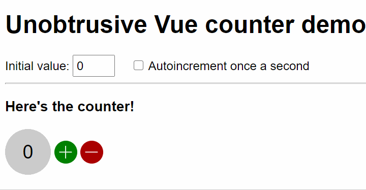

# Unobstrusive Vue
This package is a thin abstraction layer over the Vue.js v2.6 rendering engine, so it can be used in a completely unobtrusive way, i.e. it won't surface in the JavaScript or HTML code at all. You're now free to take whatever design decisions you want. This is compatible with modern browsers and IE11 even if... well, [IE11 is pretty much dead now](https://death-to-ie11.com/).



## Getting started
This project is available as the npm package [https://www.npmjs.com/package/@halleymedia/unobtrusive-vue](@halleymedia/unobtrusive-vue).

[](https://www.npmjs.com/package/@halleymedia/unobtrusive-vue)

A simple demo application is available in he [sample](./sample) directory of this project.

## Why unobtrusive

If you take a look at the [Vue.js v2 documentation](https://vuejs.org/v2/guide/#Getting-Started), you'll bump into code like this.

```js
var app5 = new Vue({
  el: '#app-5',
  data: {
    message: 'Hello Vue.js!'
  },
  methods: {
    reverseMessage: function () {
      this.message = this.message.split('').reverse().join('')
    }
  }
})
```
This way of doing things looks artificial and tightly coupled to Vue.js itself and the DOM. We believe the application logic should be freed from any framework convention. What if we could, instead, express `data` as simple properties and `methods` as, well, methods of an ES6 class?
Image we could rewrite the previous code in a more idiomatic way like this.

```js
import { component } from '@halleymedia/unobtrusive-vue'
import template from './my-component.html' //use webpack for this, see sample

@component('my-component', template)
export default class MyComponent {
  message = 'Hello application!' // A simple property

  reverseMessage () { // A method
    this.message = this.message.split('').reverse().join('')
  }
}
```
Now there's no trace whatsover of any JavaScript framework being used. It's just simple, natural and readable JavaScript code we can easily unit test. Any developer who knows how to write basic ES6 code can now take part in the project without actually having to read the Vue.js manual beforehand.

This package lets the developer do just that. It takes the burden of _mapping_ ES6 classes to Vue.js convetions.

 * **Public properties** are `data`. Use these for two-way binding with input elements;
 * **Public getters** are mapped to `computed` to Vue.js;
 * **Public setters** are mapped to component properties (or `props` as Vue.js calls them);
 * **Public methods** are... well, mapped to `methods`;
 * **Private members** are not mapped at all. Feel free to use them to store internal state of a component.

## The View
Just use the moustache syntax everywhere:
```
<button type="button" title="{{message}}" onclick="{{reverseMessage()}}">{{message}}</button>
```
Again, there's no trace of a framework being used.

Use the special attribute `render-if` when you want to dynamically render an HTML element.

```
<div render-if="{{loading}}">loading</div>
```
And use the attribute `render-for` when you want to repeat an HTML element. The `$index` and `$item` variables will be automatically made available in this context.
```
<ul>
  <li render-for="{{results}}">
    <span>{{$index}}</span>. <span>{{$item}}</span></li>
  </li>
</ul>
```
That's all you need to know. This package aims at simplicity and it intentionally does without more advanced features of Vue.js. Developers can now spend more time on the project, instead of wasting time on a framework documentation.

## Template transformation
The moustached syntax is converted to Vue.js conventions. Template transformation is done with by the `@component` decorator at runtime but it's preferred to do it beforehand, at compile time. Here's an example on how to do it with webpack using the `html-loader` and its `preprocessor` option (see [./sample/webpack.config.babel.js](sample/webpack.config.babel.js)).

```js
import { templateTransformer } from '@halleymedia/unobtrusive-vue'
//...
module: {
  rules: [
    {
      test: /\.html$/i,
      loader: 'html-loader',
      options: {
        attributes: {
          root: path.resolve(__dirname, '.')
        },
        minimize: {
          removeAttributeQuotes: false
        },
        preprocessor: (content) => templateTransformer.transform(content)
      }
    }
  ]
}
```
## Some guidance
You **must**:

 * Name your custom components using an hyphen `-`, e.g. `my-component` and not `mycomponent`. See the [valid custom element name](https://html.spec.whatwg.org/multipage/custom-elements.html#valid-custom-element-name) in the HTML specification;

 * Add only one root HTML node in a component.

You **should**:

 * Use ES6 class `properties` for two-way data binding and `getters` for one-way data binding since properties are publicly writable, getters are not;

 * Transform templates at build-time using webpack or gulp. If you don't, then it will be done at runtime and that will break compatibility with IE11 since it's using some regexp functionality which is missing from IE11.

You **should NOT**:

 * Use the `class` attribute with moustached syntax because that get complicated fast. Instead, keep things simple: use individual `data-*` attributes named as you like e.g.
   ```
   <my-component data-hidden="{{isHidden}}">Thing</my-component>
   ```
 
   Then, add this selector to your (S)CSS file:
   ```
   div[data-hidden] { display: none }
   ```

   Please note that `data-*` attributes are added/removed if you use the moustached syntax with a boolean value.

   There's [no performance penalty](https://gomakethings.com/how-performant-are-data-attributes-as-selectors/) using `data-*` attributes in selectors so there's really no need to use CSS classes;

 * Use setters to provide callbacks to child components. Implement a proper event bus instead and raise events to notify other components in the application.

**Notes**

 * All attributes on custom components elements, even known HTML attributes such as `title` and `href` are treated as component properties and they're not carried over to the root HTML element in the child component. There's an exception to that: `data-*` attributes, which you're free to (ab)use as you like.
 
   Each component should be the only responsible of defining its own HTML elements and their attributes. This will reduce code duplication.

 * Submit events are always prevented.

## Batteries not included (so you can bring the most appropriate ones for your project)
Vue.js is used here just as a rendering engine. You'll have to bring your own router and event bus, if needed in your application.

## Coding style
This project follow the JavaScript Semi Standard Style. Click the banner to learn about it.

[](https://github.com/standard/semistandard)
